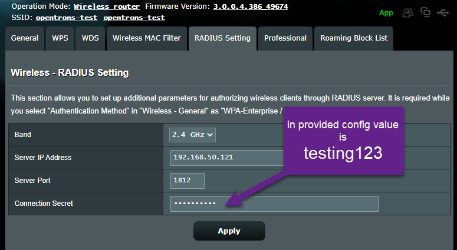
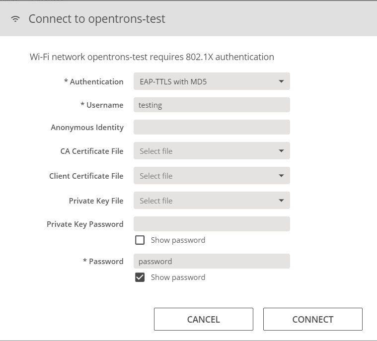
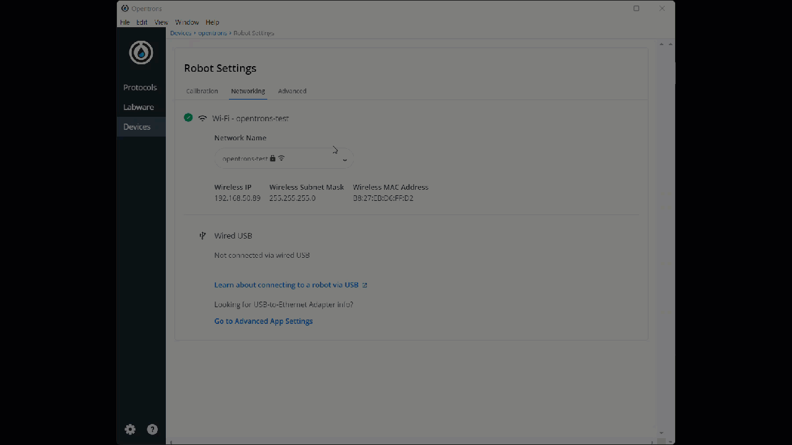
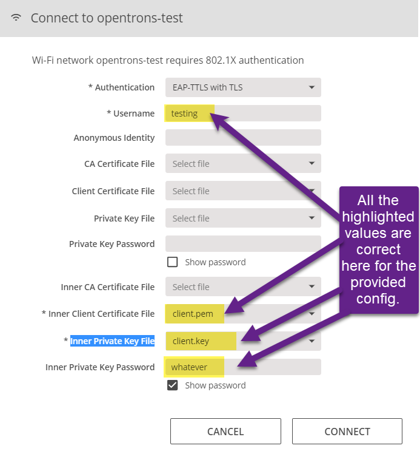

# test-802.1X

## Requirements

- Clone this repository
- Docker or Linux system
- Router capable of supporting radius
  - Docs use Asus RT-RX88U

<https://hub.docker.com/r/freeradius/freeradius-server>


## With Docker (preferred method)

1. Build an image with the provided configuration
2. Get the certificates out of the image
3. Spin up a container running the radius server in debug mode on localhost
4. Spin up a stock radius container and use `radtest` to exercise your configuration
5. Put your machine onto the wireless router
6. Configure the router
7. Configure the robot to use the passphrase or certs
8. Validate the app can connect to the robot with only WiFi
9. Repeat 7 and 8

#### Steps 1-4

```shell
docker build -t my-radius-image -f Dockerfile .
docker create --name dummy my-radius-image
docker cp dummy:/etc/raddb/certs/client.pem .
docker cp dummy:/etc/raddb/certs/client.key .
docker rm -f dummy
docker run --rm --name my-radius -t -p 1812-1813:1812-1813/udp my-radius-image -X
```
> In another terminal

```shell
docker run -it -p 1812:1812 freeradius/freeradius-server:latest /bin/bash
## issue this testing command into the terminal
radtest "testing" "password" host.docker.internal 1812 testing123
# should see success and see the radius server log the interaction
exit
```

#### Steps 5-9

1. disconnect from WiFi
1. connect to the router with ethernet cable
1. configure the router (see manufacturer's instructions on how to connect to their administration tool)
   1. Use the assigned ip address for your machine as the ip address of the "server"
   1. use port 1812




1. In the app go to Devices > Robot Settings > Networking
2. Setup one of the protocols
3. Connect successfully
4. unplug usb cable and validate the connection (lights on and off)


#### Validate



### Use certs

> Same steps as above BUT use different connection method

1. Reconnect USB (wait, this takes a minute)
2. On the dropdown for the required files choose `Add new...`



### Notes from Linux (Ubuntu 22.04)

https://wiki.freeradius.org/guide/Getting-Started


http://deployingradius.com/documents/configuration/eap.html

```shell
sudo -s
apt update
apt install -y freeradius
cp clients.conf /etc/freeradius/3.0/clients.conf
cp users /etc/freeradius/3.0/users
make -C /etc/freeradius/3.0/certs
freeradius -X
sudo lsof -iUDP -P -n | egrep -v '(127|::1)' | grep freeradiu
radtest "testing" "password" localhost 1812 testing123
```
